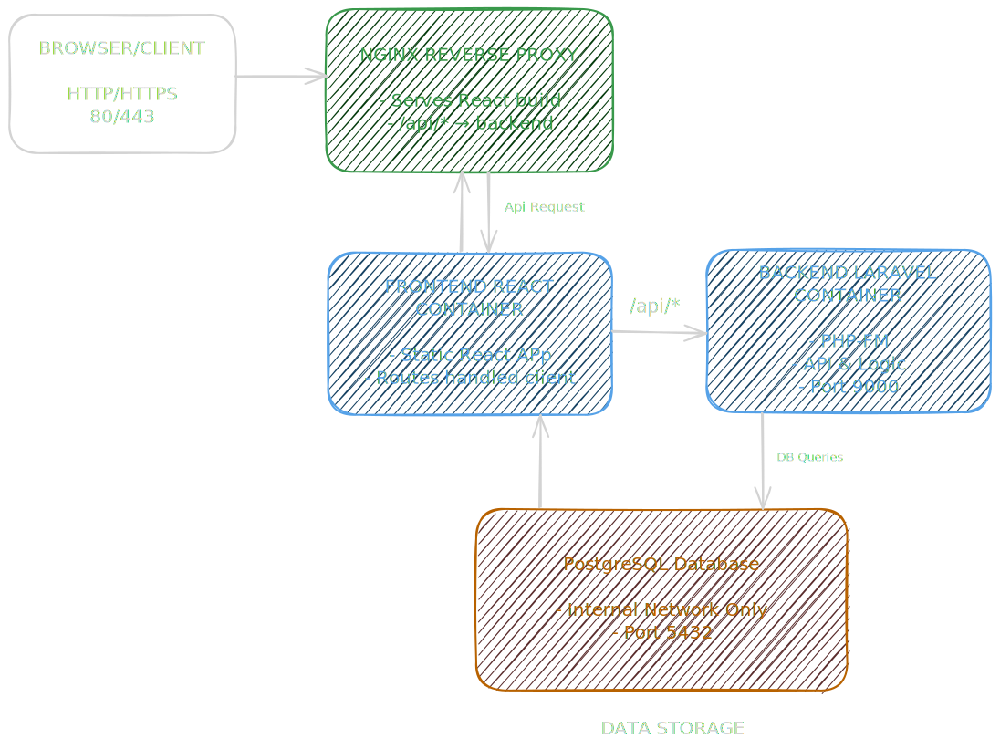

# HRIS Platform Documentation

This repository contains **platform-level documentation**
for the HRIS system.

It explains **how frontend and backend work together**,
including architecture, authentication, authorization,
and deployment.

## Repositories
- Frontend: https://github.com/muhammadidrusalawi/hris-web
- Backend: https://github.com/muhammadidrusalawi/hris-api
- Platform Docs: https://github.com/muhammadidrusalawi/hris-platform

## How to Read This Documentation
1. System Overview → `overview/`
2. Architecture → `architecture/`
3. Frontend–Backend Integration → `integration/`
4. Deployment & Environment → `deployment/`

Do NOT skip steps.

## Architecture Overview

This diagram illustrates a modern web architecture running on a bare-metal laptop with Ubuntu 22.04 using Docker: the React frontend is served by Nginx, the Laravel backend runs on PHP-FPM, and PostgreSQL serves as the database. Nginx also functions as a reverse proxy for Laravel API requests, and all containers are connected through an internal Docker network. The frontend is exposed to the public (port 80/443), while the backend and database remain internal, ensuring a secure, scalable, and production-ready setup.

